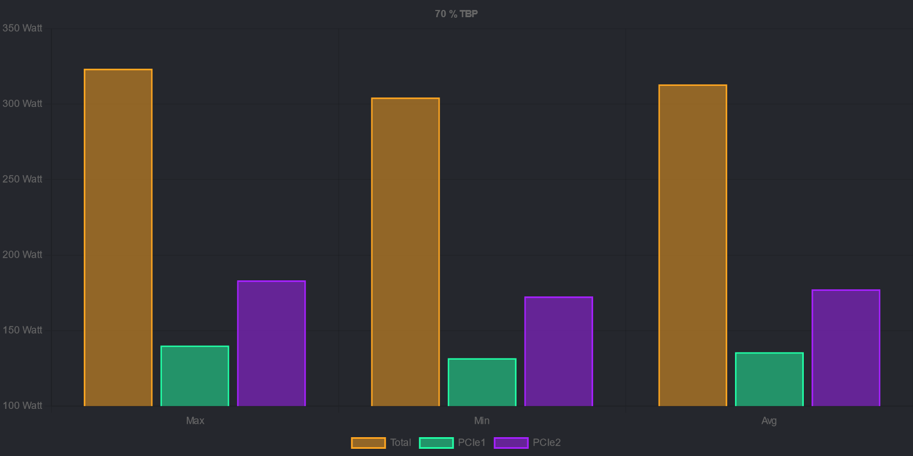
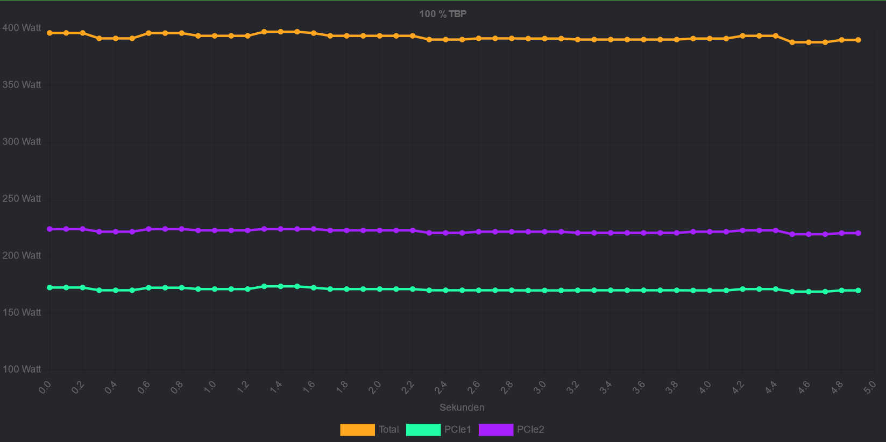
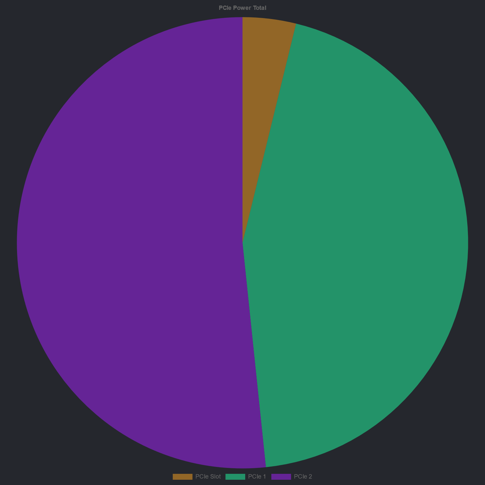

# [DevPandi] Chart BB Code
This [XenForo](https://www.xenforo.com) addon implements a BBCode with which it is possible to include various diagrams in posts and other content.

The extension is available under GPLv3 and is primarily developed for pandi.dev. New functions and improvements are only added to the extent required for the website.

## Chartist and Chart.js
Chartist version 0.11 is used in XenForo. [chartist.js](https://gionkunz.github.io/chartist-js/) is only developed relatively sporadically and appears to be largely at a standstill. Chartist is also relatively slow for many charts. [chart.js](https://www.chartjs.org) is being actively developed and uses the canvas element and copes better with large charts.

## Additional license information
chart.js stands under the MIT license.

# Usage
Three different types of diagrams are currently supported. Bars, lines and pie charts. All three charts are introduced with [chart*] and ended with [/chart*]. The information displayed is entered between the tags. The chart information is transferred in the options.

## Bar chart


```
[chartbar=title:70 % TBP;y:# Watt]x:Max;Min;Avg
Total;color:rgba(255,166,33,0.5);border:rgb(255,166,33);323.46;304.44;313.09
PCIe1;color:rgba(33,255,166,0.5);border:rgb(33,255,166);140.17;131.78;135.74
PCIe2;color:rgba(166,33,255,0.5);border:rgb(166,33,255);183.29;172.66;177.35[/chartbar]
```

Bar charts are introduced by ```[chartbar]```. Bar chart supports the following options:

 * Title (title)
 * Name of the Y-axis (y)
 * Lower limit (min)
 * Upper limit (max)
 * Axis swap (useX)

The Y-axis can either be given a general name or the values can be extended by the name. ```y:Watt``` becomes the axis designation ```Watt```. ```# Watt```  becomes ```50 Watt; 100 Watt; n Watt```. ``` Watt #``` becomes ```Watt 50; Watt 100; Watt n```.

The data to be mapped is entered in the body of the tag. The individual elements are separated by a semicolon ```;```. The first element is always the name of the element. In addition to the name, the colour of the element is determined by the colour and the frame.

 * Title
 * Colour (color:)
 * Border (border:)
 * Values

A simple element looks like this: ```name; colour:Red; border: Red; 5; 6``` Each new element is separated by a new line.

If there are several different data blocks (x-axis), corresponding values can be transferred for these. The line is then introduced with an ```x:```. This is followed by the name of the individual blocks, which are separated by a semicolon ```;```.

## Line chart


```
[chartline=title:100 % TBP;y:# Watt;x:Sekunden]x:0.0;0.1;0.2;0.3;0.4;0.5;0.6;0.7;0.8;0.9;1.0;1.1;1.2;1.3;1.4;1.5;1.6;1.7;1.8;1.9;2.0;2.1;2.2;2.3;2.4;2.5;2.6;2.7;2.8;2.9;3.0;3.1;3.2;3.3;3.4;3.5;3.6;3.7;3.8;3.9;4.0;4.1;4.2;4.3;4.4;4.5;4.6;4.7;4.8;4.9;5.0
Total;color:rgb(255,166,33);border:rgb(255,166,33);395.876;395.876;395.876;391.092;391.092;391.092;395.732;395.732;395.732;393.341;393.341;393.341;393.341;396.927;396.927;396.927;395.732;393.341;393.341;393.341;393.341;393.341;393.341;390.08;390.08;390.08;391.092;391.092;391.092;390.95;390.95;390.95;390.08;390.08;390.08;390.08;390.08;390.08;390.08;390.95;390.95;390.95;393.341;393.341;393.341;387.687;387.687;387.687;389.754;389.754
PCIe1;color:rgb(33,255,166);border:rgb(33,255,166);172.224;172.224;172.224;169.832;169.832;169.832;172.08;172.08;172.08;170.885;170.885;170.885;170.885;173.275;173.275;173.275;172.08;170.885;170.885;170.885;170.885;170.885;170.885;169.832;169.832;169.832;169.832;169.832;169.832;169.69;169.69;169.69;169.832;169.832;169.832;169.832;169.832;169.832;169.832;169.69;169.69;169.69;170.885;170.885;170.885;168.636;168.636;168.636;169.69;169.69
PCIe2;color:rgb(166,33,255);border:rgb(166,33,255);223.652;223.652;223.652;221.26;221.26;221.26;223.652;223.652;223.652;222.456;222.456;222.456;222.456;223.652;223.652;223.652;223.652;222.456;222.456;222.456;222.456;222.456;222.456;220.248;220.248;220.248;221.26;221.26;221.26;221.26;221.26;221.26;220.248;220.248;220.248;220.248;220.248;220.248;220.248;221.26;221.26;221.26;222.456;222.456;222.456;219.051;219.051;219.051;220.064;220.064[/chartline]
```

Line charts are introduced by ```[chartline]```. Line charts offer the following options

 * Title (title)
 * Name of Y-axis (y)
 * Lower limit (min)
 * Upper limit (max)
 * Name of X-axis (x)

The line chart shares the syntax of the data elements with the bar chart.

## Pie chart


```
[chartpie=title:PCIe Power Total]PCIe Slot;color:rgba(255,166,33,0.5);15
PCIe 1;color:rgba(33,255,166,0.5);175
PCIe 2;color:rgba(166,33,255,0.5);203[/chartpie]
```

Pie charts differ from the other two chart types. Only the following options are supported:

 * Title (title)

The structure of the data also differs slightly and consists of three components: Name, colour and value. As before, the three blocks are separated by a semicolon ```;``` and the colour is introduced with ```color:```. 

Accordingly, a data record looks like this:```Element name;color:rgb(255,0,0);150```.

## How colours are specified
Colours can be specified as hex code, rgb or hsl value.

 * ```#ff0000```
 * ```rgb(255,0,0)```
 * ```rgba(255,0,0)```
 * ```hsl(0 100% 50%)```
 * ```hsla(0, 100%, 50%, 0.5)```

