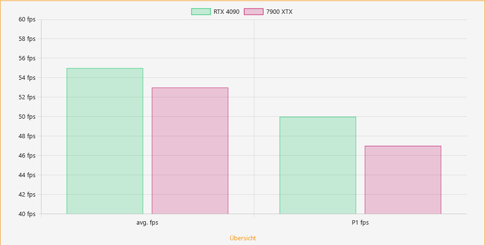

# [DevPandi] Chart BB Code
Example:
```
[chartbar=title:Some Title; y:# fps;]x:avg. fps;P1 fps
RTX 4090;color:rgba(0,191,91,0.2);border:rgb(0,191,91);55;50
7900 XTX;color:rgba(191,0,91,0.2);border:rgb(191,0,91);53;47[/chartbar]
```

Parse to:
