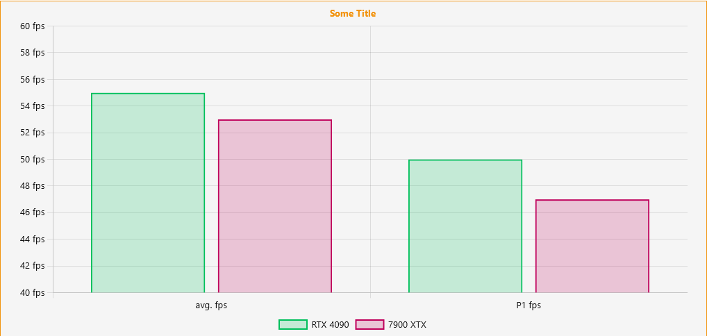

# [DevPandi] Chart BB Code
ChartBbCode is an extension for [XenForo](https://www.xenforo.com) and allows users to render a chart in their posts so that images no longer need to be created.

Currently [chart.js](https://www.chartjs.org) is used for this, as it offers more options than [chartist.js](https://gionkunz.github.io/chartist-js/). A change may be an option for the future.

## License information
chart.js stands under the MIT license.

[DevPandi] ChartBbCode is licensed under the GNU GPLv3.

# Usage
```
[chartbar=title:Some Title; y:# fps;]x:avg. fps;P1 fps
RTX 4090;color:rgba(0,191,91,0.2);border:rgb(0,191,91);55;50
7900 XTX;color:rgba(191,0,91,0.2);border:rgb(191,0,91);53;47[/chartbar]
```
